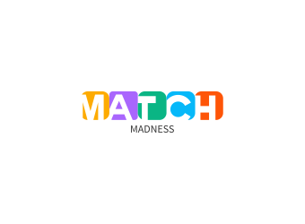

# Match Madness

<p align="center">
  
</p>


> Duolingo Match Madness inspired game recreated in React

## Running Locally

Fill out `.env` with Supabase keys

Run locally
```bash
npm run dev
```

Check out our [Next.js deployment documentation](https://nextjs.org/docs/deployment) for more details.
## To Implement

- [ ] Lives
- [ ] Personal best
- [ ] Time per match and average
- [ ] Share custom with button & load from someone else's
- [ ] Allow user to input their own json/csv to match against
- [ ] Create leaderboard
- [ ] Play against others like Typeracer
- [ ] Play against your ghost like Monkeytype
- [ ] Modal with kana <-> roumaji
- [ ] See other's created game files in a community share tab
- [ ] Anki CSV/JSON format

## Bugs

- [x] Red highlight stays on
- [ ] Playing too fast causes race condition and game state is messed up

## References

[Tailwind Elements](https://tailwind-elements.com/)

[SailboatUI](https://sailboatui.com/tools/)

[Flowbite](https://flowbite.com/docs/)


[NextUI](https://nextui.org/docs)

https://mynaui.com/

https://merakiui.com/

https://www.hyperui.dev/

https://nextjs.org/learn

https://ui.shadcn.com/docs
